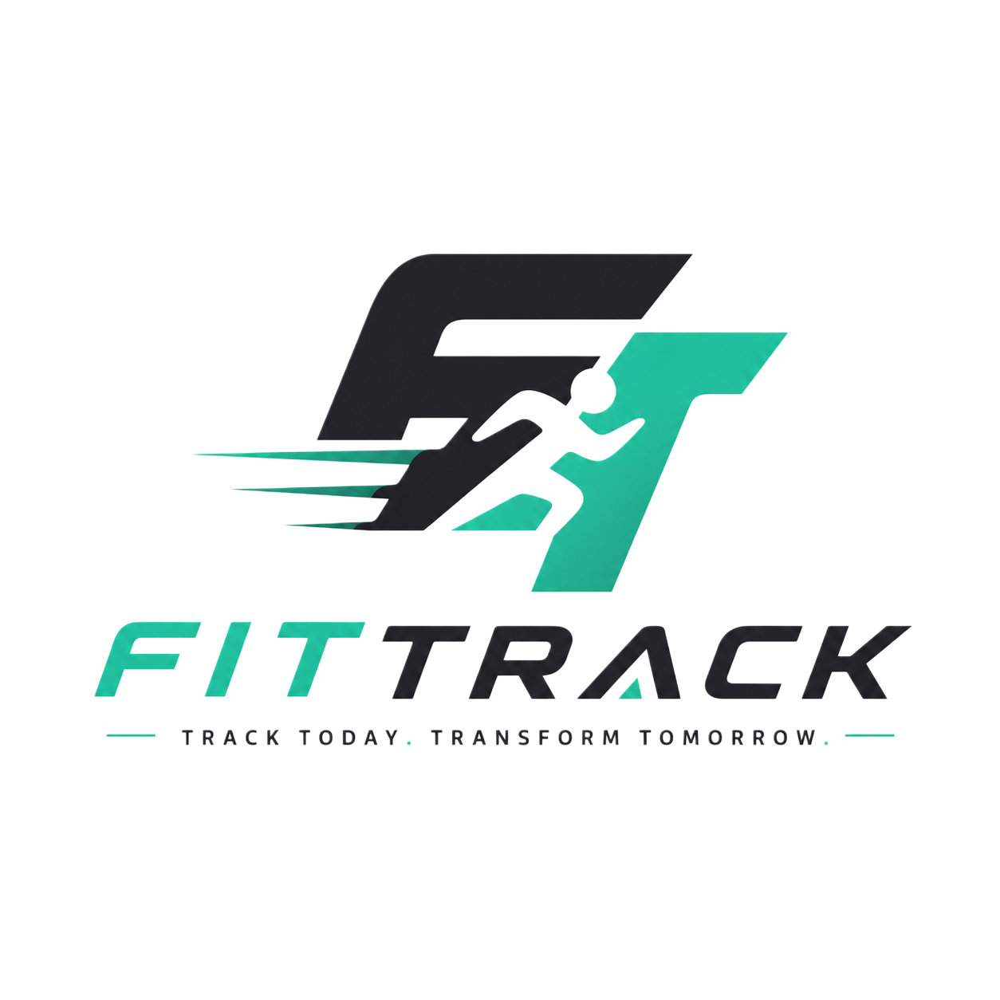
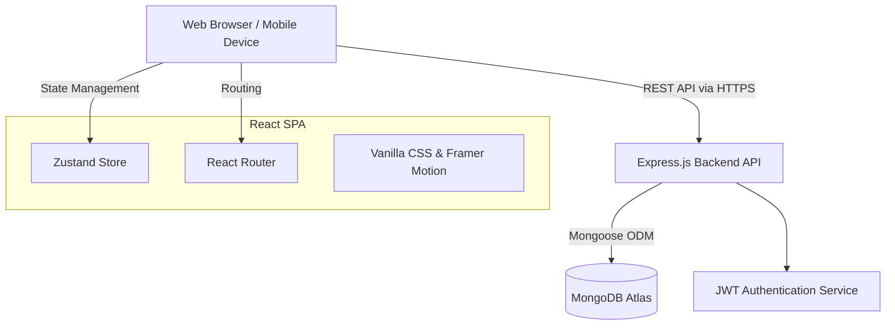

<!-- PROJECT BANNER / LOGO -->
<br />
<div align="center">
  <a href="https://github.com/YedruJahnavi/scalable_fitness_platform">
    
  </a>

  <h3 align="center">FitTrack OS</h3>

  <p align="center">
    A scalable, full-stack operational command center that unifies biometric data, adaptive AI-driven workout protocols, and real-time analytics to optimize athletic performance.
    <br />
    <a href="#about-the-project"><strong>Explore the docs »</strong></a>
    <br />
    <br />
    <a href="https://YedruJahnavi.github.io/scalable_fitness_platform/">View Demo</a>
    ·
    <a href="https://github.com/YedruJahnavi/scalable_fitness_platform/issues">Report Bug</a>
  </p>
</div>

<!-- TABLE OF CONTENTS -->
<details>
  <summary>Table of Contents</summary>
  <ol>
    <li><a href="#about-the-project">About The Project</a></li>
    <li><a href="#built-with">Built With</a></li>
    <li><a href="#system-architecture">System Architecture</a></li>
    <li><a href="#getting-started">Getting Started</a></li>
    <li><a href="#usage">Usage</a></li>
    <li><a href="#results-and-outputs">Results and Outputs</a></li>
    <li><a href="#contributors">Contributors</a></li>
    <li><a href="#license">License</a></li>
  </ol>
</details>

<!-- ABOUT THE PROJECT -->
## About The Project

Modern athletes generate vast amounts of biometric and performance data across disconnected devices and ecosystems, making it nearly impossible to glean actionable insights. Traditional fitness applications either act as passive ledgers that require tedious manual entry, or they offer generic, rigid workout routines that fail to account for an individual's dynamic recovery state and progressing capabilities.

**FitTrack** solves this fragmentation by providing a unified, scalable ecosystem. By ingesting real-time data—including recovery metrics, active calories, and volume loads—our proprietary platform generates adaptive, AI-driven daily protocols. FitTrack eliminates guesswork, replacing disjointed spreadsheets and isolated apps with an intelligent, dynamic command center designed to optimize long-term athletic progression.

### Built With

* [![React][React-shield]][React-url]
* [![Vite][Vite-shield]][Vite-url]
* [![Node][Node-shield]][Node-url]
* [![MongoDB][Mongo-shield]][Mongo-url]

<!-- SYSTEM ARCHITECTURE -->
## System Architecture

FitTrack operates on a decoupled client-server architecture to ensure high scalability and seamless user experience across all devices.



1. **Presentation Layer:** A Vite-powered React Single Page Application (SPA) utilizing Framer Motion for micro-animations and a custom scoped Vanilla CSS design system for a premium, lightweight UI.
2. **Application Layer:** An Express.js REST API handling business logic, user authentication, and data validation.
3. **Data Layer:** A fully managed MongoDB Atlas cluster ensuring secure, scalable, and highly-available persistent storage.

<!-- GETTING STARTED -->
## Getting Started

Follow these steps to get a local copy of FitTrack up and running.

### Prerequisites

* **Node.js** v18+ ([Download](https://nodejs.org/))
* **Git**

### Installation

1. **Clone the repository**
   ```sh
   git clone https://github.com/YedruJahnavi/scalable_fitness_platform.git
   cd scalable_fitness_platform
   ```

2. **Backend Setup**
   ```sh
   cd backend
   npm install
   ```
   Create a `.env` file in the `backend` directory:
   ```env
   PORT=5001
   NODE_ENV=development
   MONGO_URI=mongodb+srv://<your_db_user>:<your_password>@cluster.mongodb.net/fitpulse
   JWT_SECRET=your_secure_32_character_secret_here
   JWT_EXPIRES_IN=7d
   ```
   Start the backend server:
   ```sh
   npm run dev
   ```

3. **Frontend Setup**
   Open a new terminal window:
   ```sh
   cd frontend
   npm install
   ```
   Create a `.env.local` file in the `frontend` directory:
   ```env
   VITE_API_URL=http://localhost:5001/api
   ```
   Start the frontend development server:
   ```sh
   npm run dev
   ```

<!-- USAGE -->
## Usage

Once both servers are running, navigate to `http://localhost:5173` in your browser. 

- **Dashboard:** View your weekly progress, recovery score, and active calorie burn.
- **Workouts:** Log new sessions, track volume load, and view AI-generated adaptive plans.
- **Analytics:** Visualize your progress over time with responsive Recharts graphs.
- **Profile:** Manage your settings, themes, and integrated wearable devices.

<!-- RESULTS AND OUTPUTS -->
## Results and Outputs

The finalized application delivers:
- A perfectly responsive, glassmorphic UI that adapts flawlessly from 4K desktop monitors to mobile screens.
- Zero-latency perceived state updates via Zustand.
- Secure, stateless authentication utilizing HTTP-only JWT strategies.
- Fully automated CI/CD deployment pipelines routing the frontend directly to GitHub Pages on every `main` branch push.

<!-- CONTRIBUTORS -->
## Contributors

- **Jahnavi Yedru** - *Lead Engineer / UI/UX Designer* - [GitHub Profile](https://github.com/YedruJahnavi)

<!-- LICENSE -->
## License

Distributed under the ISC License. See `LICENSE` for more information.

<!-- MARKDOWN LINKS & IMAGES -->
[React-shield]: https://img.shields.io/badge/React-20232A?style=for-the-badge&logo=react&logoColor=61DAFB
[React-url]: https://reactjs.org/
[Vite-shield]: https://img.shields.io/badge/vite-%23646CFF.svg?style=for-the-badge&logo=vite&logoColor=white
[Vite-url]: https://vitejs.dev/
[Node-shield]: https://img.shields.io/badge/Node.js-43853D?style=for-the-badge&logo=node.js&logoColor=white
[Node-url]: https://nodejs.org/
[Mongo-shield]: https://img.shields.io/badge/MongoDB-%234ea94b.svg?style=for-the-badge&logo=mongodb&logoColor=white
[Mongo-url]: https://www.mongodb.com/
